<h1 align="center">Funked Up Chicks</h1>

Live website :arrow_down: 
<a href="https://jonathandelaney.github.io/Funked-Up-Chicks/index.html">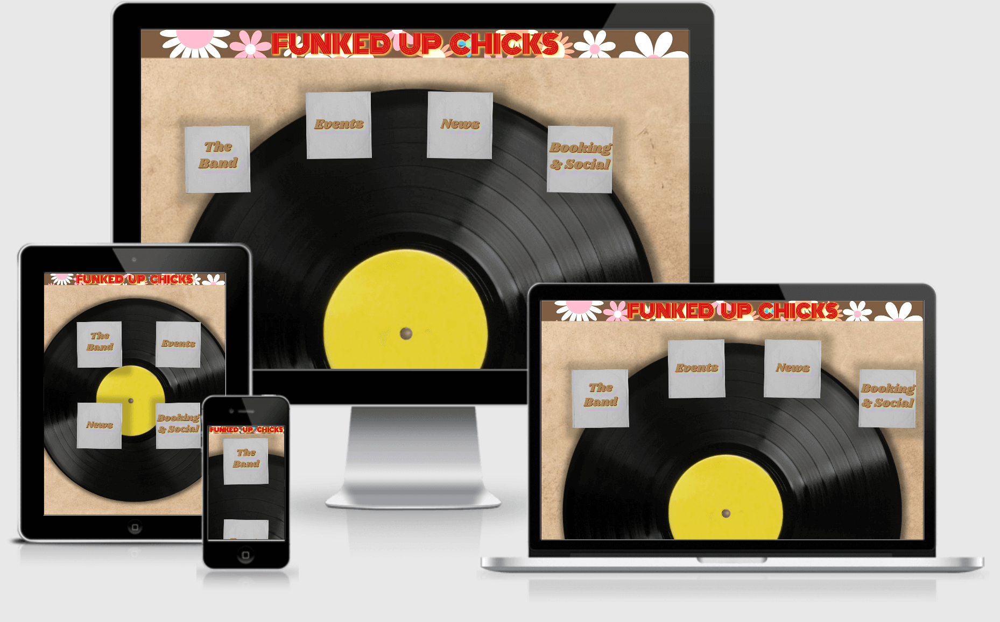</a>

## About

This is a fictitious band's website. The purpose of the Funked Up Chicks' online presence is to inform everyone of the style and funk that this imaginary band is bringing to the world.

## User Stories

- The casual stumbler

  - I want to know immediately what the band is about and what kind of musical experience to expect.
  - I want to be able to navigate the site easily.
  - I'd like for the website to be engaging and interesting to look at and explore without having the allure of a band i like encouraging me to look around.

- Someone who has heard of the band but knows little or nothing about them

  - (See previous user story)
  - I want to be able to jump directly to the page which has the information I want.
  - I should see the relevant information on each page to allow me to "get into" the band.

- A fan or someone who knows the band
  - I want to see the band represented the way i know/love them.
  - I would like to see all the info I need to keep up with their work.
  - I would want to be able to book them should i like or find out where/when I can see them.

## Design and Creation

I wanted to create a website that was representative of the genre of music but had character of its own as well. When designing the website I first came up with the genre I wanted the band to be in. I chose funk because it's a great genre of music, and one that I love very much, but also because it seemed like a colourful genre in which I could explore lots of different ideas and be creative.  
 
The next phase was coming up with the name, something which would pin down some points of the character of the band and thus the website. "Pumped up kicks" by Foster the People served as inspiration for the name, the derviation obvious there. A group of women who've got their funk on! 
 
With an image of the band now in my mind I could see what their image would be. I pictured three women with colorful hair and style and wearing sixties/seventies clothes. I don't know why myabe because that is when funk came into existance first. Nonetheless it was formed in my mind as such and so I would commit to it. With this now sort of old school image in place I liked the idea of using records in the website and having them play a central role in tying the site together. 
 
I went to work on the mockups, piecing things together as i went. The records took a backseat and onkly one ended up as the backdrop to the homepage and a record shop featured in a couple of other pages, however the old school style came through other design features such as brown paper backdrops and floral header creations. It was only when programming the website that I found inspiration to use the records more effectively in the design of the website. 

## Mockups

* ### Mobile

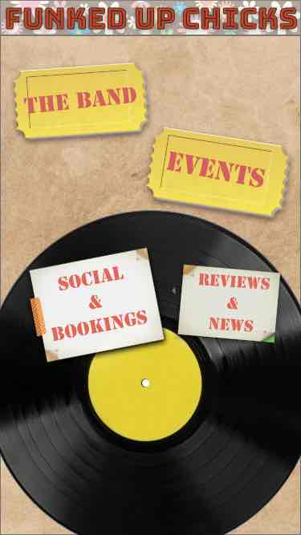 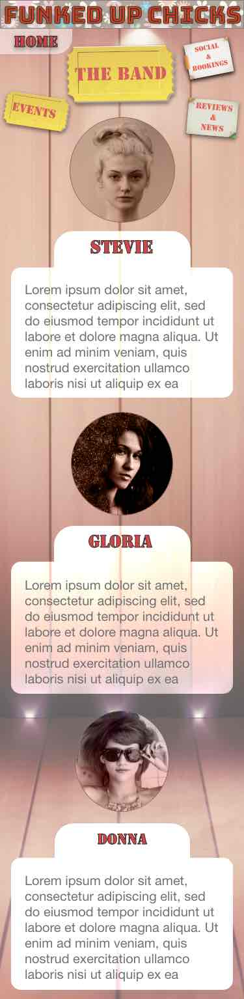 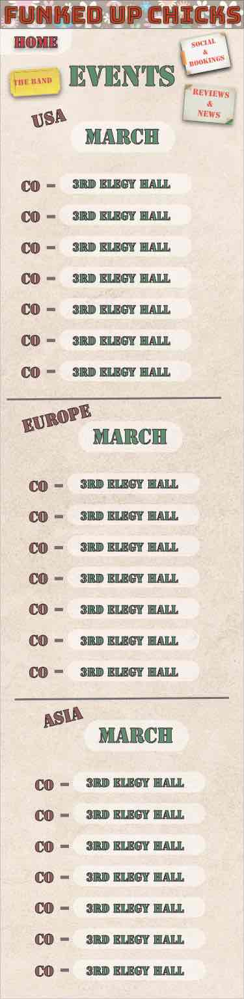 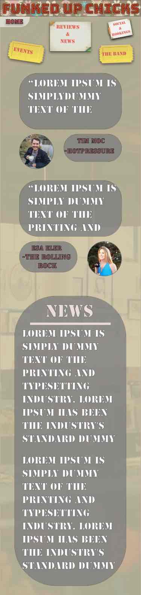 

* ### Tablet

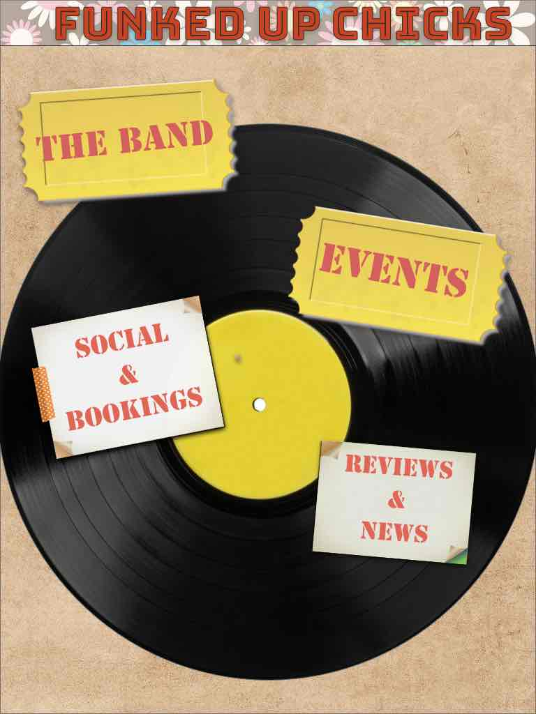 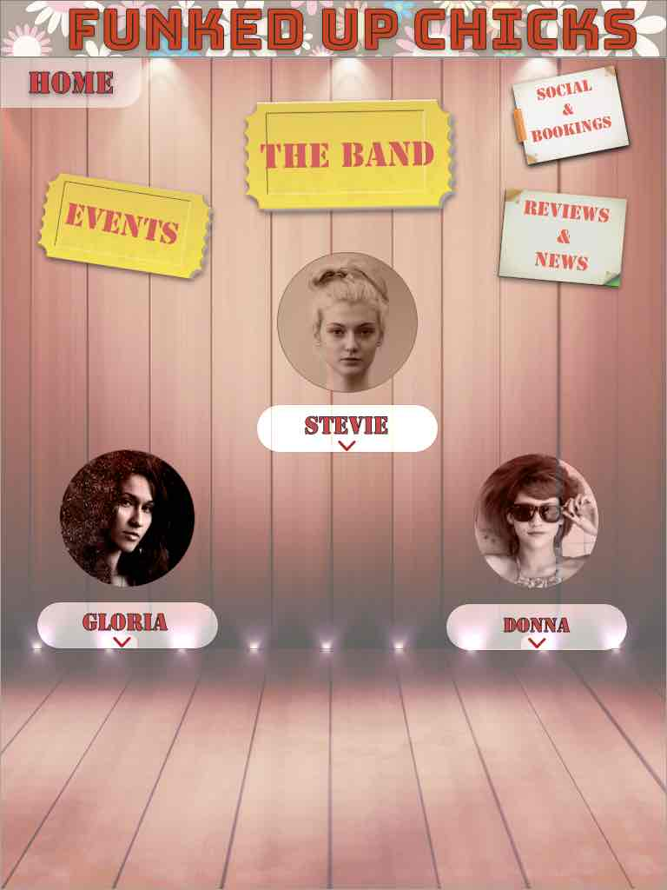 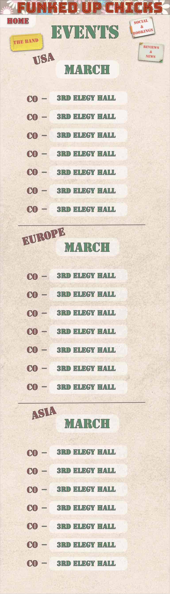 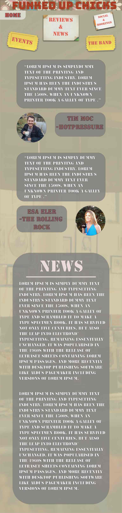 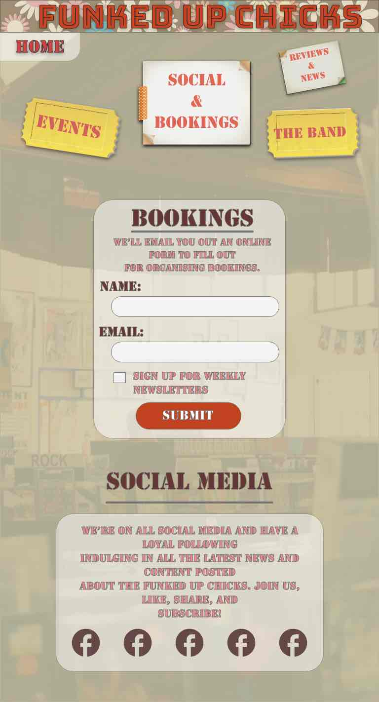

* ### Desktop

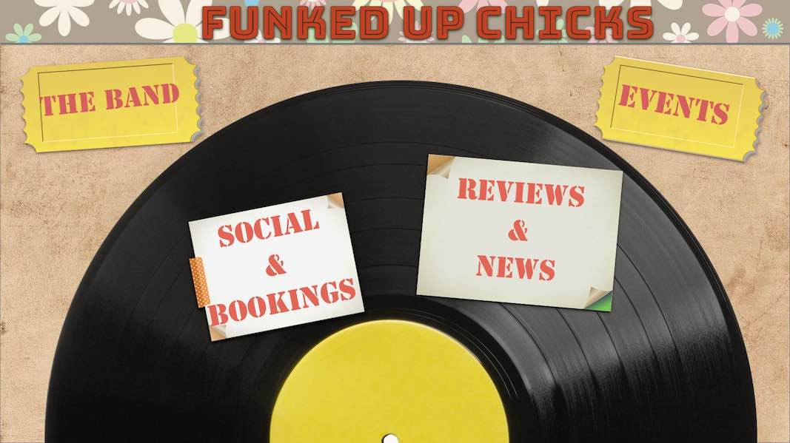  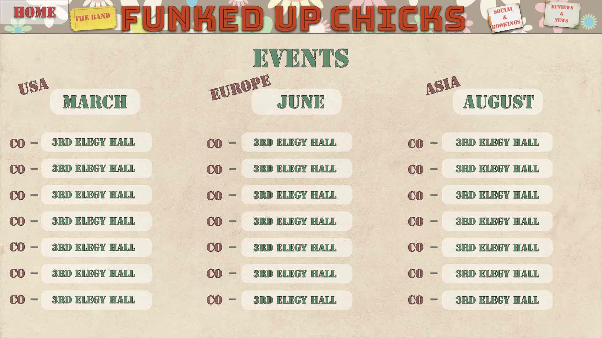 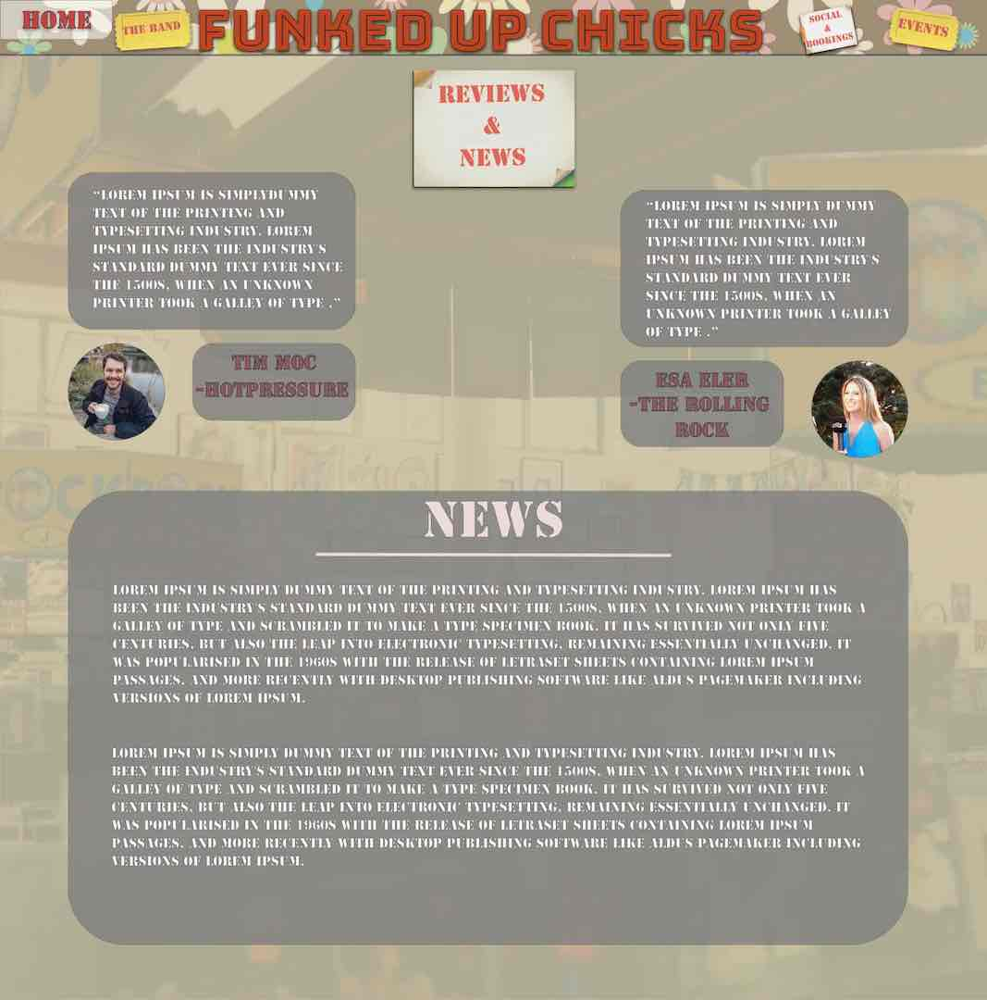 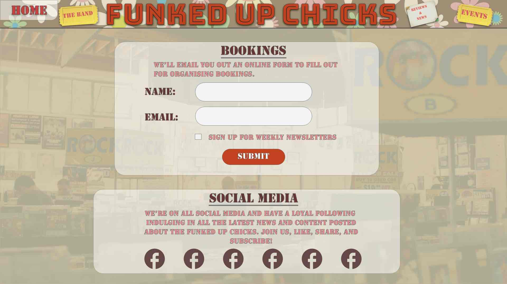

## Features

* ### Header

    - The header has a flex display with the height set with a calc() so it scales without a media query. The hover effect gives the heading psychodelic "pop".
    - The menu items are aligned to the bottom of the header and are media queried to disappear for medium and smaller screen sizes when a bootstrap dropdown menu appears below the header in the left corner. Hover effects on the menu items let them appear as though they are file tags coming off the background slightly.

* ### Homepage

    - The homepage menu items are layed out on record sleeves which are positioned inline-block. Some rotate and margin gives them an arched layout.
    - The hover effect is to simulate the records falling out of the sleeves. The sleeves have a rotate, shadow and scale transition. the records have an opacity, shadow and translate(Y) transition.
    - The responsiveness is given by changing the margin around the sleeves and the padding of the container.

* ### The Band page

    - The layout of the container is done with flex. Stevie align to start and the others centered to give a stepped look. The info box is gien asbolute to not disturb the layout of the flexbox and is centerd at the bottom of the page.
    - The hover effects on the pictues and titles are to scale up and then delay the return to normal so that the info box has time to collapse in first. Likewise the info box is delayed to not appear before the faces scale up. The effect on the info boxes is on scale and the transform origin is set to make it appear as though the info boxes are coming from the faces.
    - The media query changes the container to a flex column and makes the info boxes visible and below their respective band members. Calc() allows these to scale from medium to small with only padding adjusted for small screens.

* ### The Events page

    - The events page is layed out using bootstrap as its grid layout was the simplist for responsiveness.
    - The background is a blend-multiply of a paper image and galaxy map to achieve a vintage/modern marriage.
    - The height of the background was really all that needed to change with media query.

* ### The News page

    - The layout is done with flex in two containers. The one for the reports has a start and end alignment for each of the articles respectively.
    - The media query changes the padding and height of the background and changes the flexbox to column fro small displays. Calc() is once again instrumental in scaling all the divs on the page.

* ### The Bookings page

    - This page contains two flex containers. The form is align centrally with the submit button given a percentage width and margin so it's responsive and the rest of the container responds as a flex box and only relys ona media query for small screens to adjust the padding and margin.
    - The social media container has the fontawesome icons acting as links to the social media and music platforms. The margins on these change and the height of the container to give a nicer layout for smaller screens.

## Technologies Used

### Languages Used

-  HTML5
-  CSS3

### Frameworks and programmes used

- Gitpod was the IDE used to code the website.
- AdobeXd for the design of the mockups.
- Vectr to edit images for free.
- TnyJPG to compress images.
- Bootstrap for dropdown navigation and the events page. Json cdn included for the dropdown nav but no JavaScript required at all.

## Testing

### User experience

- The casual stumbler

  - I want to know immediately what the band is about and what kind of musical experience to expect.
    - The landing page gives the new visitor a taste for the sort of music to expect by the allusions made with records, old paper background, floral design behind the funky font used in the heading.
  - I want to be able to navigate the site easily.
    - The landing page is clean with no ambiguity around which areas of the page to interact with. The links in the header are where a user would look to naturally for navigation. The dropdown menu icon on smaller screen sizes is styled the same as the navigation links in the header so that the user will be familiar with it and know it signals navigation.
  - I'd like for the website to be engaging and interesting to look at and explore without having the allure of a band i like encouraging me to look around.
    - The animations are designed to make the site aestheticly pleasing and entising to the user to discover what each page has to offer.

- Someone who has heard of the band but knows little or nothing about them

  - (See previous user story)
  - I want to be able to jump directly to the page which has the information I want.
    - The menu items on the landing page are labeled clearly and break up the website into the most important topics a user may be interested in.
  - I should see the relevant information on each page to allow me to "get into" the band.
    - Each page highlights something about the band and gives the user an impression of what the band offers its fans.

- A fan or someone who knows the band
  - I want to see the band represented the way i know/love them.
    - The style of the website should fit the classic funk character the band has and should give the user the impression that the Funked Up Chicks themselves could have designed this or that the creator knew their music intimately.
  - I would like to see all the info I need to keep up with their work.
    - The events page and news, and booking to an extent, provide the user with all they need to keep up with the bands activities and allow a user to feel informed as much as one could be about the band.
  - I would want to be able to book them should i like or find out where/when I can see them.
    - The booking page gives the user a place to input their details and get connected through social media alternatively.

### Performance Testing

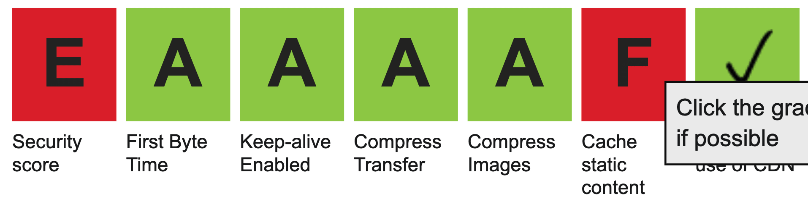
Testing of the webpage was carried out using <a href="https://www.webpagetest.org/">webpagetest.org</a>
 
The images had to be compressed alot, however i changed one problematic image to png and this worked a lot better. In future i may stick to png.

### Compatibility Testing
- Browser Compatibility

    | Screen size\Browser | Safari           | Opera            | Microsoft Edge   | Chrome           | Firefox          | Internet Explorer |
    | --------------------|:----------------:|:----------------:|:----------------:|:----------------:|:----------------:|:-----------------:|
    | Mobile              |:heavy_check_mark:|:heavy_check_mark:|:heavy_check_mark:|:heavy_check_mark:|:heavy_check_mark:| Not Tested        |
    | Desktop             |:heavy_check_mark:|:heavy_check_mark:|:heavy_check_mark:|:heavy_check_mark:|:heavy_check_mark:| Not Tested        |
    | Tablet              |:heavy_check_mark:|:heavy_check_mark:|:heavy_check_mark:|:heavy_check_mark:|:heavy_check_mark:| Not Tested        |

## Deployment

### Publishing
I published the website by following the instructions below.
1. Go to the GitHub website and log in.
2. On the left-hand side, you'll see all your repositories, select the appropriate one. ([Repository](https://github.com/JonathanDelaney/Funked-Up-Chicks) used for this project).
3. Under the name of your chosen Repository you will see a ribbon of selections, click on 'Settings' located on the right hand side.
4. Scroll down till you see 'GitHub Pages' heading.
5. Under the 'Source' click on the dropdown and select 'master branch'
6. The page will reload and you'll see the link of your published page displayed under 'GitHub' pages.
7. It takes a few minutes for the site to be published, wait until the background of your link changes to a green color before trying to open it.

### Forking
If someone wants to add to the project they can fork off the main branch by following the instructons below.
1. Go to the GitHub website and log in.
2. Locate the [Repository](https://github.com/JonathanDelaney/Funked-Up-Chicks) used for this project.
3. On the right-hand side of the Repository name, you'll see the 'Fork' button next to the 'Star' and 'Watch' buttons.
4. This will create a copy in your personal repository.
5. Once you've finished making changes you can locate the 'New Pull Request' button just above the file listing in the original repository.

### Cloning 
For someone looking to clone the repository they would follow the steps outlined below.
1. Go to the GitHub website and log in.
2. Locate the [Repository](https://github.com/JonathanDelaney/Funked-Up-Chicks) used for this project.
3. Under the Repository name locate 'Clone or Download' button in green.
4. To clone the repository using HTTPS click the link under "Clone with HTTPS".
5. Open your Terminal and go to a directory where you want the cloned directory to be copied in.
6. Type `Git Clone` and paste the URL you copied from the GitHub.
7. To create your local clone press `Enter`.

## Credits

I got my images from [pixabay.com](https://pixabay.com/) and [freeimages.com.](https://www.freeimages.com/) None of the images used require license to publish.
Kevin Powell's [youtube channel](https://www.youtube.com/channel/UCJZv4d5rbIKd4QHMPkcABCw) and various github and stackoverflow posts gave me some ideas. 
Of course I have to mention the course material was referenced and an honorable mention should be made to all the contributors to the CodeInstitute's course material.